<h2 align="center"> Hi there 👋 I'm Kaloyan Donev </h2>

 - 🔭 I'm currently not actively working on any projects.

 - 🌱 I'm currently learning C from "The C Programing Language, Second Edition" book by Brian W. Kernighan and Dennis M. Ritchie

 - 😄 Pronouns: he/him 

 - ⚡ Fun fact: I started my programing journey with Scratch. 

  

